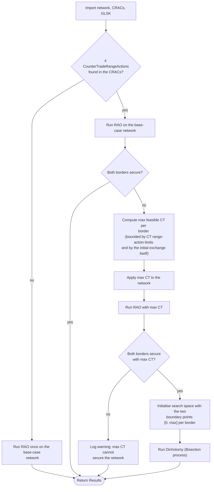

# GridCapa SWE CSA Dichotomy

This documentation details the implementation of the dichotomy algorithm in the `csa-runner-app` module to find the minimum
counter-trading (CT) volumes needed to make both SWE borders
(FR‑ES and PT‑ES) secure. It also explains how that dichotomy search is implemented on top of
[OpenRAO](https://github.com/powsybl/powsybl-open-rao) here.

## 1. Motivation

OpenRAO currently does **not** natively support the optimization of CT remedial actions in its **CASTOR** optimize. However, CT RAs are available as an option to ensure N-1 grid security for the SWE region's CSA process. Because of this gap, the concept of dichotomy is introduced here in the `csa-runner-app`. OpenRAO is purely as a security oracle in this implementation. At any given exchange volumes at both SWE borders, OpenRAO is used to check if the N-1 network security can be guaranteed through the application of available remedial actions. As the counter-trading actions are *not* supported in the RAO, the optimization of such actions is handled by the dichotomy.

## 2. Algorithm

`DichotomyRunner.runDichotomy` implements the required three phases: check if CT is needed at all, bound it with a "worst case"
maximum, then run dichotomy (a bisection-based algorithm) down to the minimum. The objective is to find the least amount of CT that must be activated at both SWE borders to ensure the grid security.

### 2.1 Step 1: Base-Case Evaluation:

A RAO is run once on the base-case network, in parallel for the FR‑ES and PT‑ES borders. If both borders are already secure, results are returned. If the CRACs don't contain the four expected counter-trading remedial actions (two directions for both borders), the application
logs a warning, runs RAO once on the base-case network, and returns that results.

### 2.2 Step 2: Maximum CT Evaluation:

For each insecure border, the largest feasible CT
volume that can physically be applied is computed. It is done taking into account:

- the admissible setpoint range of the two opposite `CounterTradeRangeAction`
  declared in the CRAC for that border (e.g. `FR→ES` and `ES→FR`), and
- the absolute value of the initial exchange on that border. We cannot
  counter-trade more than the initial exchange that actually exists on any given border.

A border that is already secure at CT = 0 keeps an upper bound of `0` (no CT is applied on that border). If either border is still
insecure at its maximum CT, the process is stopped and it is reported that there is no volume of counter-trading, based on the provided limits/initial exchanges, that can secure the network.

### 2.3 Step 3: Dichotomy (bisecting down to the minimum):

If the network is insecure with **no** CT applied and secure with the **maximum** CT volume(s) applied, both boundary points are taken as the feasible search-space to find the lowest CT amount(s) which would lead to the network's security. The dichotomy is executed as follows:

1. At each dichotomy iteration, the CT volume to be activated on each SWE border is the midpoint between the CT volume associated with the lowest secure step and the CT volume associated with the highest insecure step:
   $$
   CT_b = \frac{CT_{b,\mathrm{secure}} + CT_{b,\mathrm{insecure}}}{2}
   $$
   where:
    
- $CT_b$: CT volume to be activated on border $b$;
- $CT_{b,\mathrm{secure}}$: CT volume corresponding to the lowest secure step for border $b$;
- $CT_{b,\mathrm{insecure}}$: CT volume associated to the highest insecure step for border $b$.

2. Apply the CT volume(s) to the network.
3. Run RAO in parallel on both borders for that network state.
4. If both borders come back secure, this CT volume becomes the new best known secure solution, for each SWE border.
5. Repeat above steps until both borders individually satisfy their exit condition (the max iteration limit or the precision threshold is reached).

## 3. Configuration

The CSA dichotomy consists of two Spring application properties:

| Property | Description |
|---|---|
| `precision` | MW gap between the lowest secure and highest unsecure volumes below which a border is considered converged. |
| `max-iterations-by-border` | Maximum number of RAOs allowed per border before the dichotomy is forced to stop and return the best secure result found. |

## 4. Example

The example here illustrates exactly the functioning of the SWE CSA dichotomy algorithm here. Consider a network state with:

- Initial exchanges: PT->ES = 450 MW, FR->ES = 100 MW
- CT range-action limits: `[-300, +300]` MW on both borders
- `precision` = 3 MW, `maxDichotomiesByBorder` = 10
- Base-case network state of both SWE borders is insecure. And CT volumes of at least 200 MW on the PT-ES and 4 MW on the PT-ES border can secure the network.

Then, the dichotomy will run as follows:

| Iteration | CT tried (PT‑ES, FR‑ES) | PT‑ES | FR‑ES | Optimal so far (PT‑ES, FR‑ES) |
|---|---|---|---|---|
| 0 (max CT) | (300, 100) | secure | secure | (300, 100) |
| 1 | (150, 50) | unsecure | secure | (300, 100) *(unchanged)* |
| 2 | (225, 25) | secure | secure | **(225, 25)** |
| 3 | (187.5, 12.5) | unsecure | secure | (225, 25) *(unchanged)* |
| 4 | (206.3, 6.3) | secure | secure | **(206.3, 6.3)** |
| 5 | (196.9, 6.3) | unsecure | secure *(already converged)* | (206.3, 6.3) *(unchanged)* |
| 6 | (201.6, 6.3) | secure | secure | **(201.6, 6.3)** |
